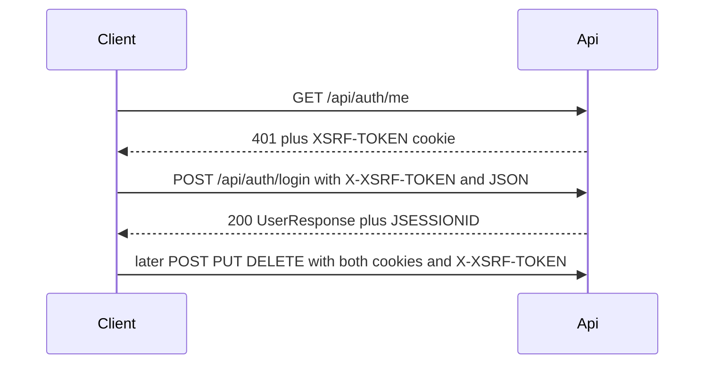

# FocusFlow AI — API Reference

Back to [README](../README.md). Machine-readable contract: [openapi.yaml](openapi.yaml).

## Base URLs

| Environment | Base URL | Notes |
|-------------|----------|-------|
| Backend | `http://localhost:8080` | Direct Spring Boot |
| Vite dev proxy | `http://localhost:5173` | Prefer for browser and cookie-aware HTTP clients; `/api` is proxied to `:8080` |

All paths below are relative to the base URL (e.g. `POST http://localhost:5173/api/auth/login`).

## Shared calling rules

### Content type

Request bodies use `Content-Type: application/json`.

### Authentication

| Route class | Endpoints | Requirement |
|-------------|-----------|-------------|
| Public (no session) | `POST /api/auth/register`, `POST /api/auth/login` | No `JSESSIONID` required |
| Session | All other routes | Valid `JSESSIONID` session cookie |

Register and login both authenticate the user and start a session (`JSESSIONID`, HttpOnly).

### CSRF

State-changing requests (`POST`, `PUT`, `DELETE`) require:

- Cookie: `XSRF-TOKEN` (readable, not HttpOnly)
- Header: `X-XSRF-TOKEN: <same value as cookie>`

This applies to public register/login as well as authenticated mutations.

**Seed the CSRF token:** send `GET /api/auth/me` (or any request that hits the CSRF filter). When logged out, **401** is expected; the response still sets `XSRF-TOKEN`.

### Unauthenticated and CSRF failures

| Condition | Status | Body |
|-----------|--------|------|
| Protected route, no session | **401** | Minimal/empty (Spring authentication entry point; not always `ApiErrorResponse`) |
| Missing or invalid CSRF on mutation | **403** | Spring Security CSRF rejection |

### Success status codes

| Code | Usage |
|------|-------|
| **200** | OK with JSON body |
| **201** | Created with JSON body |
| **204** | Success, no body |

## Error response (`ApiErrorResponse`)

Most application errors return:

```json
{
  "timestamp": "2026-06-01T12:00:00Z",
  "status": 400,
  "error": "Bad Request",
  "message": "no plannable tasks available for planning",
  "path": "/api/daily-plans/generate",
  "details": {
    "title": ["must not be blank"]
  }
}
```

| Field | Type | Notes |
|-------|------|-------|
| `timestamp` | string (ISO-8601 instant) | Present on handler-generated errors |
| `status` | integer | HTTP status |
| `error` | string | Reason phrase (e.g. `Bad Request`) |
| `message` | string | Human-readable message |
| `path` | string | Request path |
| `details` | object → string[] | Optional; field validation errors only |

Omitted null fields are excluded from JSON (`@JsonInclude(NON_NULL)`).

## Shared schemas

### Enums

| Name | Values |
|------|--------|
| `TaskPriority` | `LOW`, `MEDIUM`, `HIGH` |
| `TaskStatus` | `OPEN`, `IN_PROGRESS`, `DONE`, `CANCELLED` |

### `UserResponse`

| Field | Type | Required |
|-------|------|----------|
| `id` | integer | yes |
| `email` | string | yes |
| `username` | string | yes |

### `TaskResponse`

| Field | Type | Required | Notes |
|-------|------|----------|-------|
| `id` | integer | yes | |
| `title` | string | yes | |
| `description` | string \| null | yes | |
| `priority` | `TaskPriority` | yes | |
| `status` | `TaskStatus` | yes | |
| `dueDate` | string (date) \| null | yes | `YYYY-MM-DD` |
| `estimatedMinutes` | integer \| null | yes | |

### `DailyPlanItemResponse`

| Field | Type | Required |
|-------|------|----------|
| `position` | integer | yes |
| `task` | `TaskResponse` | yes |

### `DailyPlanWarning`

| Field | Type | Required |
|-------|------|----------|
| `minimumAvailableMinutes` | integer | yes |
| `estimatedTasks` | array | yes |
| `unestimatedTasks` | array | yes |

`estimatedTasks[]`: `{ "taskId": number, "title": string, "estimatedMinutes": number }`

`unestimatedTasks[]`: `{ "taskId": number, "title": string }`

### `DailyPlanResponse`

| Field | Type | Required | Notes |
|-------|------|----------|-------|
| `id` | integer | yes | |
| `planDate` | string (date) | yes | `YYYY-MM-DD` |
| `createdAt` | string (instant) | yes | ISO-8601 |
| `items` | `DailyPlanItemResponse[]` | yes | |
| `availableMinutes` | integer \| null | yes | `null` on plans saved before 1.0.2 |
| `warning` | `DailyPlanWarning` \| null | yes | Shortfall snapshot from generate time; `null` when no shortfall or pre-1.0.2 row |

List and get return the same extended shape after refresh.

---

## Auth

### `POST /api/auth/register`

Create account and start a session.

| | |
|---|---|
| **Auth** | Public |
| **CSRF** | Required |

**Request body — `RegisterRequest`**

| Field | Type | Required | Validation |
|-------|------|----------|------------|
| `email` | string | yes | Valid email, not blank |
| `username` | string | yes | 3–30 characters, not blank |
| `password` | string | yes | Min 8 characters, not blank |

**Example**

```json
{
  "email": "you@example.com",
  "username": "youruser",
  "password": "password123"
}
```

**Responses**

| Status | Body |
|--------|------|
| **201** | `UserResponse` |
| **400** | `ApiErrorResponse` — validation failed (`details` per field) |
| **409** | `ApiErrorResponse` — `message`: `email already registered` or `username already taken` |

---

### `POST /api/auth/login`

Start a session.

| | |
|---|---|
| **Auth** | Public |
| **CSRF** | Required |

**Request body — `LoginRequest`**

| Field | Type | Required |
|-------|------|----------|
| `username` | string | yes, not blank |
| `password` | string | yes, not blank |

**Example**

```json
{
  "username": "youruser",
  "password": "password123"
}
```

**Responses**

| Status | Body |
|--------|------|
| **200** | `UserResponse` |
| **401** | `ApiErrorResponse` — `message`: `Invalid credentials` |

---

### `POST /api/auth/logout`

End session. Configured in Spring Security (not `AuthController`).

| | |
|---|---|
| **Auth** | Session |
| **CSRF** | Required |

**Request body:** none

**Responses**

| Status | Body |
|--------|------|
| **204** | Empty; session invalidated, `JSESSIONID` deleted |
| **401** | Not authenticated |

---

### `GET /api/auth/me`

Current user.

| | |
|---|---|
| **Auth** | Session |
| **CSRF** | Not required |

**Responses**

| Status | Body |
|--------|------|
| **200** | `UserResponse` |
| **401** | Not authenticated |

---

## Tasks

All task routes require session. Mutations require CSRF.

### `POST /api/tasks`

Create task.

**Request body — `CreateTaskRequest`**

| Field | Type | Required | Notes |
|-------|------|----------|-------|
| `title` | string | yes | Not blank |
| `description` | string | no | |
| `priority` | `TaskPriority` | no | Default `MEDIUM` |
| `dueDate` | string (date) | no | `YYYY-MM-DD` |
| `estimatedMinutes` | integer | no | |

**Example**

```json
{
  "title": "Write tests",
  "description": "TDD coverage",
  "priority": "HIGH",
  "dueDate": "2026-06-01",
  "estimatedMinutes": 60
}
```

**Responses**

| Status | Body |
|--------|------|
| **201** | `TaskResponse` (status `OPEN`) |
| **400** | Validation failed |
| **401** | Not authenticated |

---

### `GET /api/tasks`

List current user's tasks (ordered by due date ascending).

**Responses**

| Status | Body |
|--------|------|
| **200** | `TaskResponse[]` |
| **401** | Not authenticated |

---

### `GET /api/tasks/{id}`

Get one task.

**Path parameters**

| Name | Type |
|------|------|
| `id` | integer |

**Responses**

| Status | Body |
|--------|------|
| **200** | `TaskResponse` |
| **401** | Not authenticated |
| **404** | `ApiErrorResponse` — `message`: `task not found` |

---

### `PUT /api/tasks/{id}`

Update task.

**Path parameters**

| Name | Type |
|------|------|
| `id` | integer |

**Request body — `UpdateTaskRequest`**

| Field | Type | Required | Notes |
|-------|------|----------|-------|
| `title` | string | yes | Not blank |
| `description` | string | no | |
| `priority` | `TaskPriority` | no | Default `MEDIUM` if omitted |
| `status` | `TaskStatus` | no | Default `OPEN` if omitted |
| `dueDate` | string (date) | no | |
| `estimatedMinutes` | integer | no | |

**Example**

```json
{
  "title": "Write tests",
  "description": "TDD coverage",
  "priority": "HIGH",
  "status": "IN_PROGRESS",
  "dueDate": "2026-06-01",
  "estimatedMinutes": 60
}
```

**Responses**

| Status | Body |
|--------|------|
| **200** | `TaskResponse` |
| **400** | Validation failed |
| **401** | Not authenticated |
| **404** | `message`: `task not found` |

---

### `DELETE /api/tasks/{id}`

Delete task.

**Path parameters**

| Name | Type |
|------|------|
| `id` | integer |

**Responses**

| Status | Body |
|--------|------|
| **204** | Empty |
| **401** | Not authenticated |
| **404** | `message`: `task not found` |

---

## Daily plans

All daily-plan routes require session. Mutations require CSRF.

### `POST /api/daily-plans/generate`

Generate a plan from plannable tasks (`OPEN` and `IN_PROGRESS`). Calls the AI provider, validates ranking, persists plan with `availableMinutes` and optional `warning` snapshot.

**Request body — `GeneratePlanRequest`**

| Field | Type | Required | Validation |
|-------|------|----------|------------|
| `availableMinutes` | integer | yes | Min 1 |
| `planDate` | string (date) | no | `YYYY-MM-DD`; defaults to today |

**Example**

```json
{
  "availableMinutes": 120,
  "planDate": "2026-06-01"
}
```

**Responses**

| Status | Body |
|--------|------|
| **201** | `DailyPlanResponse` |
| **400** | `message`: `no plannable tasks available for planning` or validation failed |
| **401** | Not authenticated |
| **502** | `ApiErrorResponse` — AI provider failure (`message` from provider or `AI provider request failed`) |

On **502**, nothing is saved.

**Example success (truncated)**

```json
{
  "id": 1,
  "planDate": "2026-06-01",
  "createdAt": "2026-06-01T10:00:00Z",
  "availableMinutes": 120,
  "warning": null,
  "items": [
    {
      "position": 1,
      "task": {
        "id": 5,
        "title": "Write tests",
        "description": "TDD coverage",
        "priority": "HIGH",
        "status": "IN_PROGRESS",
        "dueDate": "2026-06-01",
        "estimatedMinutes": 60
      }
    }
  ]
}
```

---

### `GET /api/daily-plans`

List saved plans for the current user.

**Query parameters**

| Name | Type | Required | Notes |
|------|------|----------|-------|
| `planDate` | string (date) | no | Filter to `YYYY-MM-DD` |

**Responses**

| Status | Body |
|--------|------|
| **200** | `DailyPlanResponse[]` |
| **401** | Not authenticated |

---

### `GET /api/daily-plans/{id}`

Get one saved plan.

**Path parameters**

| Name | Type |
|------|------|
| `id` | integer |

**Responses**

| Status | Body |
|--------|------|
| **200** | `DailyPlanResponse` |
| **401** | Not authenticated |
| **404** | `message`: `daily plan not found` |

---

### `DELETE /api/daily-plans/{id}`

Owner-scoped hard delete. Removes the plan and its items; tasks remain.

**Path parameters**

| Name | Type |
|------|------|
| `id` | integer |

**Responses**

| Status | Body |
|--------|------|
| **204** | Empty |
| **401** | Not authenticated |
| **404** | `message`: `daily plan not found` |

---

## Client call sequence



For curl/Postman:

1. `GET /api/auth/me` through the Vite proxy (401 seeds `XSRF-TOKEN`).
2. Read `XSRF-TOKEN` from the cookie jar.
3. Send `POST`/`PUT`/`DELETE` with `X-XSRF-TOKEN: <token>` and the same cookie jar.
