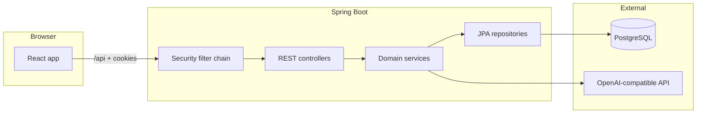
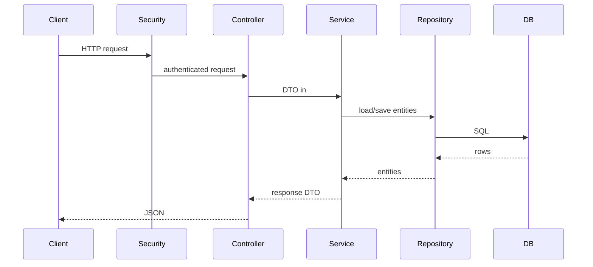
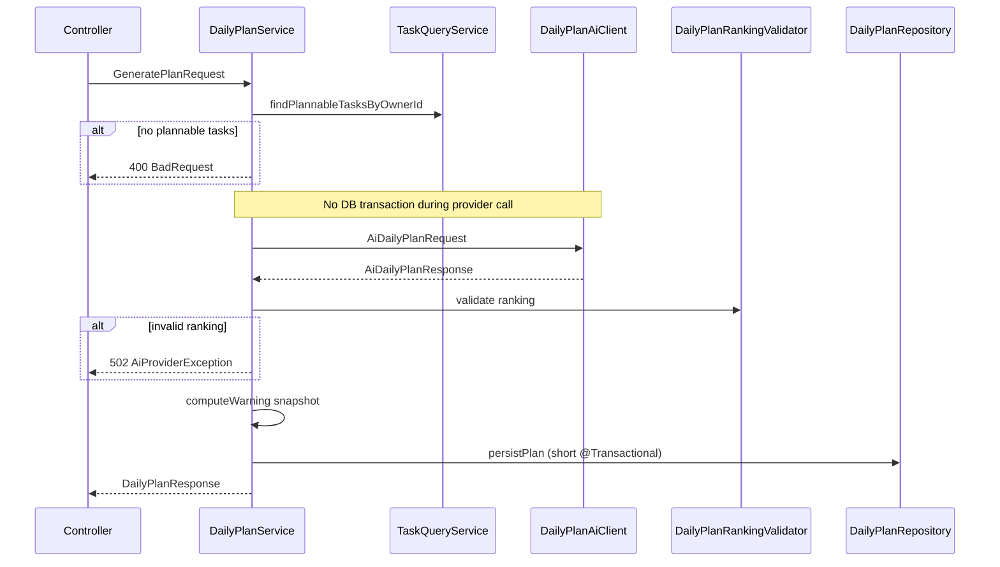
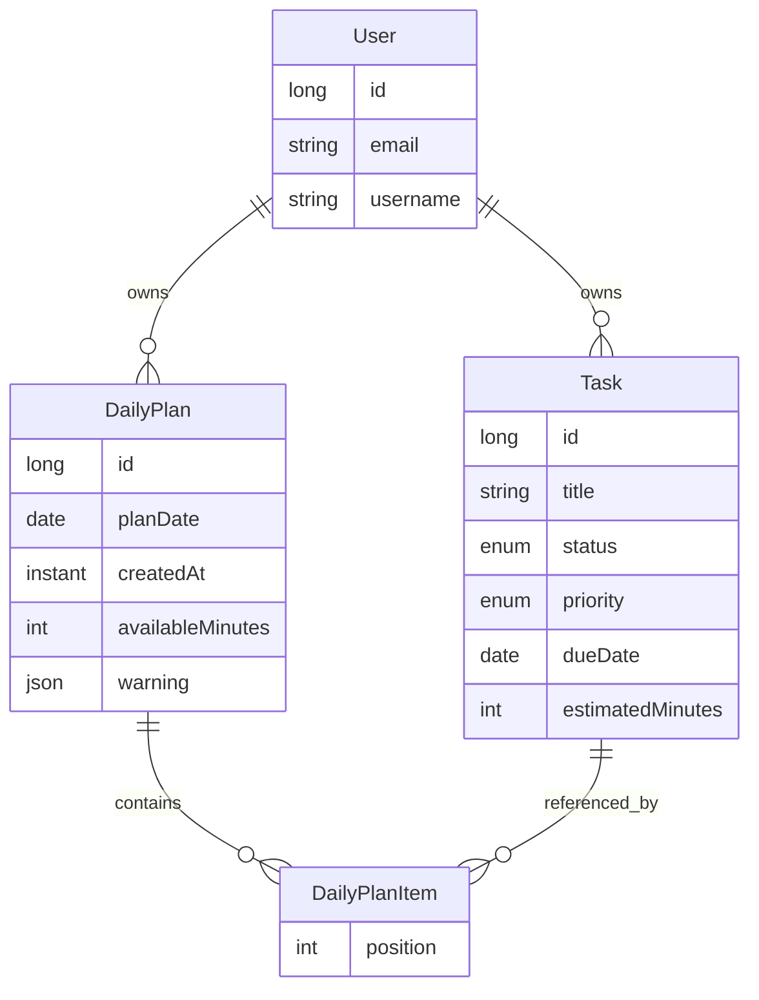

# FocusFlow AI — Architecture

Back to [README](../README.md). API contract: [api.md](api.md).

This document describes how the system is structured, what each backend component does, and how those components work together. For endpoint-level detail, see the [API reference](api.md).

## System overview

FocusFlow AI is a session-based full-stack app:

- **Backend** — Spring Boot (Java 21), JPA/Hibernate, PostgreSQL, Flyway migrations. Exposes a JSON REST API under `/api`.
- **Frontend** — React, TypeScript, Vite. Talks to the backend through a dev proxy with cookie credentials and CSRF headers.
- **External AI** — OpenAI-compatible HTTP API for daily-plan generation (configurable via env vars).

## Request path

Every HTTP request passes through observability and security filters before reaching a controller:

1. **Request ID filter** — Validates or generates `X-Request-Id`, sets MDC for logging, echoes the header on every response (including **401**/**403**).
2. **Security filter chain** — Session cookie (`JSESSIONID`) checked for protected routes. CSRF validated on `POST`/`PUT`/`DELETE`. Public routes: register/login and detail-free liveness/readiness probes. Unauthenticated requests to protected routes return **401**.
3. **Controller** — Validates request DTOs (`@Valid`), delegates to a service, returns response DTOs. No repository access.
4. **Service** — Business logic and transactions. Resolves the current user via `CurrentUser` → `UserContext`. Owner-scoped reads use `findByOwner_IdAndId` patterns.
5. **Repository** — Persistence only. Plan detail reads use `@EntityGraph` to load items and nested tasks; list/history uses projection queries that never load item graphs.
6. **Exception handling** — `GlobalExceptionHandler` maps domain exceptions to `ApiErrorResponse` JSON (**400**, **404**, **409**, **502**, etc.), including optional `requestId` from MDC.

## Backend components

### `security` — authentication, CSRF, and probes

| Component | Role |
|-----------|------|
| `SecurityConfig` | Main filter chain: public register/login; session auth elsewhere; cookie CSRF; logout at `POST /api/auth/logout`. Public liveness/readiness actuator probes. Dev-profile chain permits Swagger/OpenAPI paths only. |
| `FocusFlowUserDetailsService` | Loads `User` by username for Spring Security |
| `CsrfCookieFilter` | Ensures `XSRF-TOKEN` cookie is available to clients |
| `CurrentUser` | Reads `SecurityContext`, returns `UserContext` (id, email, username) to services |
| `UserContext` | Internal identity record — not an HTTP DTO |

Services never depend on auth API DTOs; they call `currentUser.getCurrentUser()` for the owner id.

### `common/observability` — request correlation and probes

| Component | Role |
|-----------|------|
| `RequestIdFilter` | Servlet filter (highest precedence): validate/generate `X-Request-Id`, MDC, response header echo |
| `ObservabilityConfig` | Registers `RequestIdFilter` before Spring Security |
| Actuator (config) | Exposes health (with liveness/readiness groups) and metrics; aggregate health and metrics require a session |

Micrometer counters/timers in `OpenAiDailyPlanClient` and `DailyPlanRankingValidator` record bounded provider and ranking-rejection tags.

### Schema and migrations — Flyway

| Component | Role |
|-----------|------|
| `db/migration/V1__baseline.sql` | Canonical PostgreSQL schema (users, tasks, daily plans, items) |
| Flyway auto-config | Applies migrations at startup; `ddl-auto: none` in default profile |
| `LegacySchemaAdoptionCommand` | One-shot operator command: preflight existing DB, baseline at V1 (see README) |

Integration tests use the same Testcontainers Postgres fixture and Flyway migrations; Hibernate `validate` in the test profile checks entity/schema agreement.

### `user` — accounts

| Component | Role |
|-----------|------|
| `User` | JPA entity: email, username, password hash |
| `UserRepository` | Lookup by email/username/id |

Used by `AuthService` (registration) and `CurrentUser` (session resolution).

### `auth` — registration and login API

| Component | Role |
|-----------|------|
| `AuthController` | `POST /register`, `POST /login`, `GET /me` |
| `AuthService` | BCrypt hashing, duplicate checks, `AuthenticationManager` login, maps to `UserResponse` |

Register and login both establish a server session (`JSESSIONID`).

### `task` — task CRUD and query facade

| Component | Role |
|-----------|------|
| `TaskController` | CRUD under `/api/tasks` |
| `TaskService` | Owner-scoped create/list/get/update/delete; defaults `priority` → `MEDIUM`, new tasks → `OPEN` |
| `TaskQueryService` | **Facade** for cross-feature reads — `findPlannableTasksByOwnerId` (`OPEN` + `IN_PROGRESS`) |
| `TaskRepository` | Owner-scoped queries |
| `TaskResponseMapper` | Entity → `TaskResponse` DTO |

The plan feature reads tasks only through `TaskQueryService`, not `TaskRepository` (enforced by ArchUnit).

### `plan` — daily plans

| Component | Role |
|-----------|------|
| `DailyPlanController` | Paged summary list, latest (200/204), get-by-id, delete, generate under `/api/daily-plans` |
| `DailyPlanService` | Orchestrates generate, list/get/latest/delete; maps entities to response DTOs |
| `DailyPlanRankingValidator` | Reject-not-repair validation of AI ordering; increments Micrometer rejection counter with bounded reason tag |
| `DailyPlan` / `DailyPlanItem` | Aggregate: plan owns ordered items; each item references a live `Task` |
| `DailyPlanWarningSnapshot` | JSON snapshot persisted on the plan at generate time |
| `DailyPlanRepository` | Owner-scoped reads: projection queries for paged summaries; `@EntityGraph` for detail and latest |

**Summary vs detail:** History list endpoints return `DailyPlanSummaryResponse` via repository projections (`itemCount`, `hasWarning`) without loading plan items or tasks. Detail, generate, and latest load the full graph for `DailyPlanResponse`.

**Generate flow** (the main orchestration):

Steps in code:

1. Load plannable tasks (`OPEN`, `IN_PROGRESS`). Empty → **400**, no provider call.
2. Call `DailyPlanAiClient.generate` **outside** a database transaction (retries/timeouts cannot hold a connection).
3. `DailyPlanRankingValidator.validate` — reject invalid AI output; throw `AiProviderException` → **502**, nothing saved.
4. `computeWarning` from must-include candidates (IN_PROGRESS + due/overdue OPEN).
5. `persistPlan` (transactional) saves `DailyPlan` with items, `availableMinutes`, and warning snapshot.
6. Map to `DailyPlanResponse` (warning is never recomputed on read).

**Latest for a date:** `GET /api/daily-plans/latest?planDate=...` returns the newest plan for that calendar date, or **204** when none exists.

**Delete** removes the plan and its items only; referenced tasks remain.

### `ai` — provider boundary

| Component | Role |
|-----------|------|
| `DailyPlanAiClient` | Interface — mockable in tests |
| `OpenAiDailyPlanClient` | OpenAI-compatible HTTP implementation with bounded retry/timeouts and Micrometer timers/counters |
| `DailyPlanPromptBuilder` | Prompt text with task lines, status, ranking rules |
| `AiProviderException` | Provider/validation failures → **502** via `GlobalExceptionHandler` |
| `OpenAiProperties` / `OpenAiClientConfiguration` | Env-driven model, base URL, API key |

The plan service depends on the interface, not the HTTP client directly.

### `common/error` — API error contract

| Component | Role |
|-----------|------|
| `GlobalExceptionHandler` | Maps exceptions to `ApiErrorResponse` |
| `BadRequestException` | **400** (e.g. no plannable tasks) |
| `NotFoundException` | **404** (missing or not owned) |
| `ConflictException` | **409** (duplicate email/username) |
| `ForbiddenOperationException` | **403** |
| `ApiErrorResponse` | Shared JSON error shape (optional `requestId`) |

## Data model

- **Owner scoping** — Tasks and plans are always filtered by `owner_id`. Foreign ids return **404**, not **403**.
- **Plan items** — Hold `position` and a reference to a `Task`. Task edits after generate can diverge from the frozen warning snapshot (accepted).
- **Warning** — Nullable JSON column; computed once at generate from the candidate task set.

## Frontend structure

The React app mirrors backend feature boundaries:

| Area | Location | Role |
|------|----------|------|
| HTTP client | `frontend/src/lib/api.ts` | `fetch` with `credentials: 'include'`, CSRF header on mutations |
| Types | `frontend/src/types/api.ts` | Mirrors backend DTOs |
| Auth | `features/auth/` | Login/register forms, session hooks |
| Tasks | `features/tasks/` | List, form, actions |
| Plans | `features/plans/` | Generate card, `DailyPlanView`, history, warning alert, delete |
| Routes | `routes/` | Dashboard, plan detail/history, login/register |

Vite proxies `/api` to `:8080` in development so session cookies stay same-site from the browser’s perspective (`localhost:5173`).

TanStack Query hooks in each feature invalidate cache keys after mutations (e.g. plan delete refreshes list and today’s plan).

## Layering checklist (contributors)

- Controllers delegate to services only; never inject repositories.
- Services own business logic and transactions; repositories handle persistence only.
- Cross-feature reads go through facades (e.g. `TaskQueryService`), not another feature's repository.
- Security exposes `UserContext`, not auth API DTOs, to other layers.
- Architecture rules are enforced by `LayeredArchitectureTest` (ArchUnit) in `backend` tests.

## Java and Spring learning map

Open these packages in roughly this order to trace a request from HTTP to persistence and back:

- **`auth`** — `AuthController` and `AuthService` show registration, login, the Spring Security authentication manager, BCrypt password hashing, and clear duplicate-email/username conflicts.
- **`security`** — `SecurityConfig`, `CsrfCookieFilter`, `CurrentUser`, and `UserContext` teach filter-chain configuration, cookie-based CSRF, a **401** authentication entry point, session logout, and how application code receives the current user without depending on auth API DTOs.
- **`user`** — `User` and `UserRepository` are the core JPA account entity and repository. Study the uniqueness constraints before following the auth service.
- **`task`** — `TaskController`, `TaskService`, `TaskQueryService`, and `TaskRepository` teach owner-scoped CRUD, transactions, mapping, and a small query facade. `TaskQueryService` lets the plan feature read tasks without coupling directly to another feature's repository.
- **`plan`** — `DailyPlanController`, `DailyPlanService`, `DailyPlan`, `DailyPlanItem`, and `DailyPlanRepository` show orchestration, persistence of an aggregate, and owner-scoped reads. The service rejects generation with no plannable tasks (`OPEN` and `IN_PROGRESS`) before making an external request.
- **`ai`** — `DailyPlanAiClient` is the mockable provider boundary; `OpenAiDailyPlanClient` is the OpenAI-compatible implementation. Follow `DailyPlanPromptBuilder` to see structured prompt construction and `AiProviderException` to see provider failures become **502** responses.
- **`common/error`** — `GlobalExceptionHandler` and the exception types define the API error contract: validation or domain preconditions **400**, unauthenticated **401**, missing owner-scoped data **404**, conflicts **409**, and AI-provider failures **502**.
- **Repositories and JPA fetching** — Compare owner-id repository methods. `DailyPlanRepository` uses `@EntityGraph` and `SELECT DISTINCT` to load plan items and their tasks while `open-in-view` is disabled, avoiding lazy-initialization failures on response mapping.
- **DTOs and validation** — Request/response records under each feature's `dto` package separate the HTTP contract from JPA entities. `RegisterRequest`, for example, validates email, username, and password before `AuthService` runs.
- **Tests** — Mockito service tests isolate business behavior; `@WebMvcTest` controller tests exercise JSON, validation, and security boundaries; `PostgresIntegrationTest` uses Testcontainers for real PostgreSQL behavior; `LayeredArchitectureTest` uses ArchUnit to enforce dependency rules.

The frontend is the practical counterpart: Vite proxies `/api`, `frontend/src/lib/api.ts` uses `credentials: 'include'`, and it reads the CSRF cookie to attach the matching header for mutating requests.
